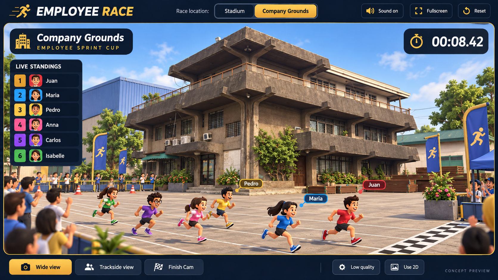

# Company Grounds — 3D Building and Race Map

Status: exterior release implemented (Phases 1–4), with verification and remaining visual/device limits recorded in [implementation notes](COMPANY_GROUNDS_IMPLEMENTATION_NOTES.md). Phase 5 remains deferred.

## Approved visual direction

The user selected the generated Company Grounds mockup below as the intended appearance of the new location. Treat it as the primary composition and UI reference throughout implementation, not merely an optional inspiration.



Reference file: [`COMPANY_GROUNDS_UI_REFERENCE.png`](COMPANY_GROUNDS_UI_REFERENCE.png). This is a generated concept image, not an implemented game screenshot. The original building photos remain the architectural reference.

Match these visible characteristics:

- The recognizable company building dominates the central background, shown from its corner with the projecting concrete balconies, roof canopy, terrace railings, dark windows and entrance visible.
- A broad concrete courtyard fills the foreground. White lane markings run across the yard toward a checker finish stripe on the right. Use courtyard paving rather than a red stadium running surface for this venue.
- Colorful runners remain unobstructed in front of the building. Spectators, blue-and-gold event flags, barriers and plants frame the course from its edges.
- Use bright daytime lighting, warm gray concrete and green landscaping. Keep the building facade legible rather than silhouetted or hidden by grandstands.
- Retain the dark navy and gold UI: location selector in the header area, Company Grounds title at the upper left, timer at the upper right, compact standings on the left, and camera/quality controls along the bottom.
- Use the reference's readable three-quarter composition for the main preview/wide view. Follow and finish cameras may adapt to race progress and viewport size, while preserving the building's role as the venue landmark.

The six runners in the image illustrate a sample race, not a participation limit. Preserve all-entrant selection, focused lane groups, scrollable full standings and other existing game functionality. On mobile, adapt the interface instead of shrinking the entire desktop mockup.

Implementation may simplify textures, plants, spectators and small geometry for performance, but must preserve the building silhouette, concrete courtyard setting, landmark placement and navy/gold UI hierarchy. Do not substitute a generic office building or a standard stadium with the company building as a tiny distant prop. The image's exact reflections, material detail and lighting are visual targets, not a promise of pixel-identical real-time rendering.

Visual acceptance: compare an actual desktop Company Grounds screenshot beside this image at the exterior blockout and final verification stages. Record any intentional differences and their performance or responsive-layout reasons. The `CONCEPT PREVIEW` watermark belongs only to the reference image and must not appear in the playable UI.

## 1. Goal and recommended first release

Create a recognizable, stylized Three.js version of the company's building from the supplied photos, and use it as the landmark for a new **Company Grounds** race location. Match the existing cartoon runners and lightweight stadium presentation.

The first release includes the building exterior, a courtyard race track, a location selector, compatible race cameras, and a winner podium with the building entrance in the background. Preserve Stadium as the default location. An opening camera sequence and interior lobby are separate later phases, not requirements for the exterior release.

This is an artistic reconstruction, not a measured architectural model. Do not claim exact dimensions, floor plans or unseen elevations from the supplied images.

## 2. Reference interpretation

| Reference | Visible features to preserve | Planned use |
| --- | --- | --- |
| Exterior photo | Gray/brown concrete facade, broad balcony slabs, projecting roof, substantial columns and support brackets, upper terrace railings, dark gridded windows, ground-level entrance, plants | Building silhouette and exterior details |
| Interior display photo | Dark wood cabinetry, trophies, framed religious images, statues and warm interior colors | Optional later lobby/display area |
| Entrance photo | Dark-framed glass doors, tiled floor, suspended ceiling and waiting seats | Optional later entrance/lobby layout |

Prioritize silhouette and balcony proportions before small details. The distinctive concrete projections should identify the building even when windows and plants are simplified.

Model only what is visible with confidence. Use neutral, simplified walls on unseen sides. The interior photos do not establish the complete room layout or its exact relationship to the exterior entrance.

Reference handling:

- The photos are currently supplied in conversation; do not assume they already exist in the repository.
- If files become available locally, record their exact paths in the implementation notes. Keep source references separate from runtime assets.
- Use the exterior as a modeling guide, rather than placing the whole photograph on a flat box.
- Omit the photographed person, vehicles and incidental street clutter from the default model.
- Use a generic `Company Grounds` sign until the exact company name/logo is supplied or confirmed. Do not guess small or partially obscured sign text.
- Additional front/side/rear photos and approximate dimensions would improve accuracy, but are optional for the initial stylized exterior.

## 3. Player experience

### Setup

Replace the fixed Stadium theme card with two accessible selection cards:

1. **Stadium** — existing venue and behavior.
2. **Company Grounds** — company building and courtyard.

Selecting a location updates the idle preview without generating a new race result. Show the selected location with text and a selected state, not color alone. Disable location changes while a race is being prepared or running.

### Race flow

`Select location → Preview → Start Race → Countdown → Camera follow → Finish Cam → Winner Spotlight → Results / Race Again`

- Preserve the existing countdown and race clock.
- Keep the same location on Race Again, Edit Participants and Reset race.
- New Game keeps location along with the other race settings, consistent with the current confirmation text.
- Page reload returns to the app's default unless persistence is deliberately added separately.
- All eligible employees participate, including rosters up to 100. The scene remains a focused broadcast view of at most twelve lanes.

### 2D and recovery

Company Grounds must remain usable when the user selects 2D or loses WebGL. Show a lightweight, code-generated courtyard/building banner and the selected venue name; keep the existing 2D lane system and all participants. Clearly describe the simplified 2D presentation.

Retry 3D must restore the same venue, race snapshot, clock and winners. Renderer fallback must never reroll the race or reset exclusion history.

## 4. Exterior model specification

Build an original procedural component using Three.js primitives and a small amount of custom geometry where needed. A Blender/GLB pipeline is optional later, not a prerequisite.

### Main geometry

- Ground-level mass, upper building mass and roof structure based on the visible facade.
- Wide, thick balcony slabs with pronounced overhangs.
- Vertical concrete columns and simplified curved/tapered support brackets.
- Upper terrace/parapet and repeated metal railings.
- Dark window panels with instanced grid bars or a lightweight generated grid texture.
- Entrance frame, doors, small canopy/awning where visible, and simple steps/threshold.
- Roof extension and a few simplified wall-mounted air-conditioning units.

### Materials and details

- Warm gray concrete, darker undersides, muted metal railings and dark window panes.
- Subtle color variation to suggest weathering; avoid a heavy texture stack.
- Prefer opaque dark glass with a highlight to real-time transparent reflections.
- Simplified plants around the base and entrance.
- Optional low-detail stacks of construction materials at the far edge of the courtyard, outside the track and camera corridor.
- Avoid tiny geometry that cannot be seen from racing distance.

### Adjustable design parameters

Keep building width, depth, level heights, balcony depth, roof overhang and entrance placement in a single configuration. This makes likeness adjustments straightforward without editing many mesh coordinates.

Acceptance at this stage: front three-quarter and side views clearly show the photo's recognizable silhouette; the building reads as the supplied reference rather than a generic office block.

## 5. Courtyard and track layout

Keep the existing race coordinate contract: runners move along X from approximately -10 to +10, with lane spacing along Z. Do not change normalized progress or finish timing to accommodate scenery.

```text
           BUILDING / ENTRANCE
         plants and clear setback
       spectators / event decorations
  START ======================= FINISH
        focused courtyard race lanes
         camera-facing clear space
```

- Place the building behind the far side of the course, biased toward the starting half so the entrance is recognizable in setup.
- Orient the detailed facade toward the primary camera.
- Set building clearance from the outer visible lane using the viewport lane count, not the full employee count.
- Use warm concrete paving, clear lane markings, a starting stripe and the existing recognizable checker finish.
- Keep flags, barriers, plants and crowds outside the runner and label projection areas.
- Use the existing instanced crowd system with venue-specific placement data. Do not animate static building geometry.

### Large-roster behavior

The venue is one broadcast set, not a physically reconstructed hundred-lane campus. Switching focused lane groups changes the displayed runners and lane numbers while retaining the venue. Keep the environment footprint stable within a race so changing from a twelve-runner group to the final four-runner group does not visibly move the building or rebuild the courtyard.

Separate `displayedRunnerCount` from `environmentLaneCapacity` where necessary. Preserve global employee IDs, lane IDs and full standings. Do not rearrange runners according to their final rank to stage the building shot.

## 6. Scene architecture and ownership

### Proposed new files

| File | Responsibility |
| --- | --- |
| `src/data/locations.js` | Valid location IDs, titles, palette and environment/camera parameters |
| `src/components/LocationSettings.jsx` | Setup selector and accessible selected state |
| `src/components/three/CompanyBuilding3D.jsx` | Reusable exterior mesh, independent of game state |
| `src/components/three/CompanyGrounds3D.jsx` | Courtyard, building placement, venue lights, crowd and decorative props |
| `src/components/three/RaceEnvironment.jsx` | Select Stadium or Company Grounds for the active snapshot |
| `src/components/three/TrackSurface3D.jsx` | Shared track markings and finish geometry, extracted only as needed |
| `src/components/CompanyGroundsBanner.jsx` | Lightweight 2D venue illustration/banner |
| `tests/company-grounds.test.js` | Location normalization, snapshot and camera-bound invariants |
| `tests/browser-company-grounds.mjs` | Venue switching, racing, celebration, recovery and mobile checks |

Final file boundaries may be simplified during implementation. Avoid a broad rewrite solely to match this list.

### Existing integration points

- `App.jsx`: location state, selector, preview and passing the selected location into race settings.
- `race.js`: normalize `settings.location`, default old/unknown values to Stadium, store it in the frozen snapshot. Location must not consume RNG draws.
- `raceWorker.js` / `useRace.js`: carry location through worker preparation and snapshot restoration without changing the generation/cancellation safeguards.
- `RaceScene3D.jsx`: select the environment using `game.race.settings.location` during a race, and the setup selection while idle. Keep one Canvas and the existing error boundary.
- `Stadium3D.jsx`: retain current venue behavior; extract shared pieces without changing their visual placement.
- `RaceCamera.jsx`: read venue framing parameters rather than adding a second camera controller.
- `Crowd3D.jsx`: allow explicit spectator placements while preserving instancing, pause and reduced-motion behavior.
- `WinnerSpotlight3D.jsx`: accept venue metadata for the podium background.
- `RaceTrack.jsx` and broadcast text: display the correct venue label; remove hard-coded Stadium wording where appropriate.

### Scene resource rules

- Exactly one owner for scene background, fog and main lights in each active mode.
- `CompanyBuilding3D` must not create its own camera, renderer, animation clock or global scene background.
- Reuse building geometry/material resources when placed in racing and celebration views; dispose resources when no longer owned, not while shared by an active scene.
- Map switching and replay must not leave duplicate lights, animation callbacks or canvases.
- Keep scene lifecycle/context-loss handling independent of which environment is mounted.

## 7. Camera behavior

### Initial release

- Setup preview: elevated three-quarter angle that shows the facade and course.
- Countdown: existing readable starting view; no additional delay before racing.
- Mid-race: existing camera-follow behavior so the courtyard passes behind the runners.
- Final stretch: existing timing trigger and padded finish framing, including trailing visible runners.
- Manual Stadium/Trackside controls should be renamed where necessary to venue-neutral labels such as `Wide view` and `Trackside view`.
- On mobile, prioritize runners, finish line and labels over showing the whole building.
- Check the complete camera path against roof overhangs and balcony silhouettes. Building visibility must never hide runners or the finish stripe.
- Preserve reduced motion and deterministic clock sampling through pause/resume and context recovery.

### Optional later opening shot

Add a short establishing view of the building with a **Skip intro** button. It must be a distinct pre-countdown presentation state; race elapsed time cannot advance during it. First race per visit is a reasonable default, with replay bypassing it. Reduced motion uses a static establishing image or immediate cut. This phase requires explicit state/lifecycle tests before enabling it.

## 8. Winner celebration

For Company Grounds, place the existing gold podium and runners-up composition in front of a simplified entrance backdrop. Keep the building behind the characters and below the winner card's visual priority.

- Preserve the winner's identity, trophy, twelve-second rotation, confetti, finish time and controls.
- Reuse the same building model with a celebration placement preset; do not model another unrelated facade.
- Use warm entrance lighting and a small crowd. Avoid combining the full stadium's lights with the celebration lights.
- Keep the winner card in its existing desktop/mobile positions.
- Retain Stadium's current celebration appearance.
- No second gameplay simulation or result selection is introduced for this scene.

## 9. Performance budget

These are implementation targets, not current measurements or guarantees.

| Area | Initial target |
| --- | --- |
| Building exterior | Approximately 5,000–15,000 triangles in normal quality; fewer details in low quality |
| Additional environment draw calls | Aim for no more than 25 over the equivalent stadium view; measure with renderer statistics |
| Repeated windows, bars, railings and plants | Shared materials and instanced/merged geometry |
| Optional textures | Prefer generated/simple materials; if needed, keep each at or below 1024px and total added downloads around 1 MB or less |
| Lighting | One primary shadow-casting light in normal mode; preserve the existing no-shadow low-quality behavior |
| Crowd | Reuse existing capped updates and fixed spectator count; never scale crowd count with 100 employees |
| Race rendering | Retain at most twelve rendered runners and six local floating labels in large-roster mode |
| Device validation | Target at least 30 FPS on an agreed representative device in low quality; report actual measurements and frame-time spikes |

Compare Stadium and Company Grounds on the same device, viewport, roster, quality and race scenario. Software-rendered headless browser measurements verify behavior but do not certify physical GPU performance. If the map misses the budget, simplify railings, windows, plants and shadows before changing gameplay or reducing eligible entrants.

## 10. Interior phase — deferred

The interior photos can support a separate optional **Company Lobby** presentation later:

- Dark-framed entrance doors and tiled floor.
- Simplified seating and ceiling panels.
- Trophy/display cabinetry based on the photos.
- Religious artwork/statues only as deliberate reference-based details; do not assume exact images or fine text can be reconstructed from these photos.

Do not build a walkable interior, collision system or first-person controls for the exterior race release. A separate static lobby/menu view is a smaller follow-up than an explorable building. If detailed artwork assets are later needed, identify their actual source files and intended treatment before producing them.

## 11. Implementation sequence

### Phase 1 — foundation and exterior blockout

1. Record current Stadium screenshots and renderer measurements.
2. Add location configuration and the setup selector with Stadium default.
3. Add location to frozen race settings and verify worker transport.
4. Build the main building silhouette with basic materials.
5. Place it beside a courtyard course in the idle preview.

Deliverable: selectable Company Grounds preview with recognizable exterior proportions. Capture front/side/mobile screenshots before investing in small details. This review checkpoint is for visual refinement, not an automatic permission gate.

### Phase 2 — complete exterior race environment

1. Add instanced railings/windows, entrance, plants and limited props.
2. Integrate track markings, finish stripe and venue-specific crowd positions.
3. Keep environment dimensions stable during focused-lane changes.
4. Tune normal, trackside, follow and finish camera bounds.
5. Add the simplified 2D venue banner and correct location labels.

Deliverable: a full Company Grounds race from setup through finish for small and large rosters.

### Phase 3 — celebration and lifecycle

1. Add entrance-background placement for the winner podium.
2. Verify lighting ownership, reduced motion and low-quality settings.
3. Exercise replay, participant edits, Reset, New Game, worker cancellation and 3D recovery.
4. Check resource cleanup across repeated venue changes and races.

Deliverable: complete venue lifecycle with preserved results and winner exclusion.

### Phase 4 — optimize, verify and document

1. Measure geometry, draw calls, memory and frame times against Stadium.
2. Reduce expensive details if targets are missed.
3. Run automated and browser checks below.
4. Capture final screenshots, document approximated features and record device limitations.
5. Update README and implementation notes with the new selector and map behavior.

Deliverable: release-ready exterior map with evidence and known limits.

### Phase 5 — optional expansions

Opening building shot, lobby scene, exact signage/logo and more faithful facade textures. These are follow-ups; do not silently include them in the initial exterior implementation.

## 12. Verification matrix

| Dimension | Cases |
| --- | --- |
| Locations | Stadium and Company Grounds; switch repeatedly before starting |
| Rosters | 2, 6, 12, 13 and 100 eligible participants |
| Durations | Short preset plus 1-minute and 10-minute custom settings; validate effective large-field duration |
| Renderer | 3D normal, 3D low quality, 2D selection, WebGL unavailable and context loss/retry |
| Layout | Desktop, tablet and narrow mobile viewport |
| Motion | Normal, reduced motion, pause/resume and hidden-tab return |
| Camera | Setup, countdown, follow, manual view, final stretch and lane-group switching |
| Race lifecycle | Replay, edit participants, cancel preparation, Reset cancel/confirm and New Game |
| Results | Correct winner, complete standings, unchanged times, exclusion and restoration |

Logic checks:

- Same roster, seed, duration and gameplay settings produce identical order, events, motion samples and finish times for both locations.
- Location survives worker cloning and remains fixed throughout the active race.
- Unknown location IDs safely fall back to Stadium.
- Camera bounds retain runners and finish line; scenery does not change progress calculations.

Browser checks:

- Keyboard-accessible selector and correct selected state.
- Venue appears before the Start button becomes ready; loading/error states remain actionable.
- Building and balcony do not cover runner bodies, labels or the finish stripe in representative views.
- Company Grounds identity is visible in setup and celebration without obscuring controls.
- All 100 participants remain in standings while only the focused lane group is rendered.
- Context recovery and 2D fallback preserve the active race and selected location.
- No runtime exceptions, horizontal mobile overflow, duplicate canvases or accumulating resources after repeated switches.

Run the existing logic suite, ESLint, production build and the dedicated venue browser tests. Use accelerated-clock tests for long races, but also inspect a normal-speed race for camera motion and crowd readability.

## 13. Completion criteria

- Both locations are selectable; Stadium remains functional and visually stable.
- The building is recognizable from the exterior photo through its silhouette and major facade details.
- Company Grounds supports the complete race and podium flow in 3D and an honest simplified 2D fallback.
- Existing fairness, timing, 100-employee support, winner exclusion and comeback behavior remain intact.
- No building/track intersections or camera obstructions in tested layouts.
- Automated checks pass and screenshots plus measured performance results are recorded.
- Any remaining likeness or physical-device limitations are stated explicitly.

Recommended execution scope: **Phases 1–4 first; Phase 5 only as a separate follow-up.**
